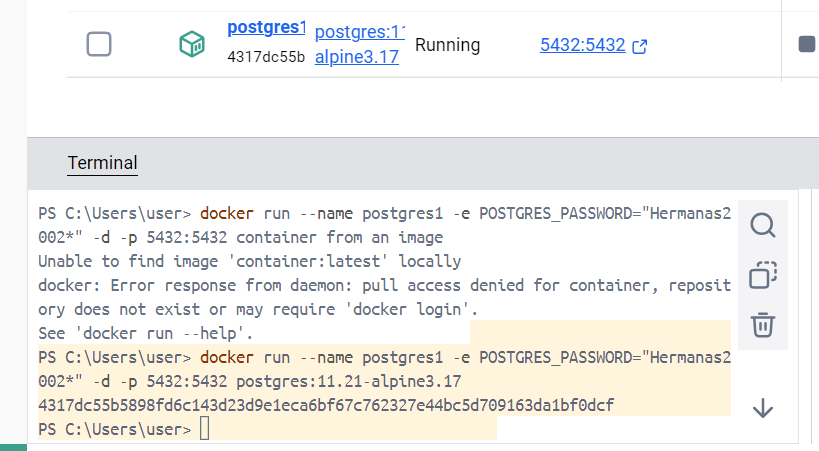
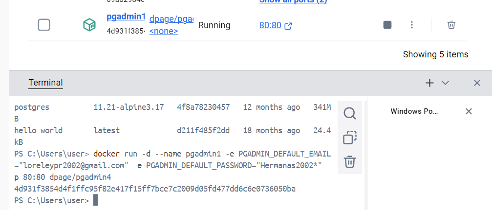
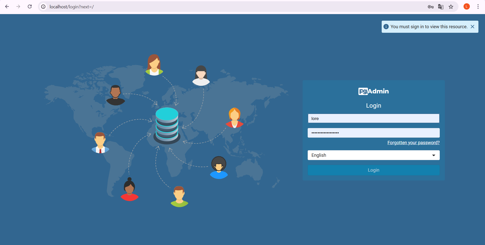
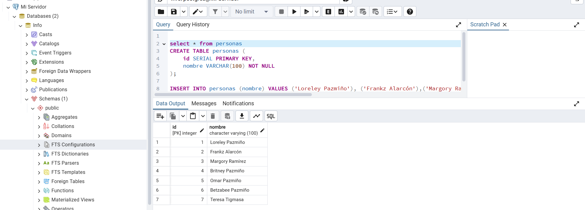
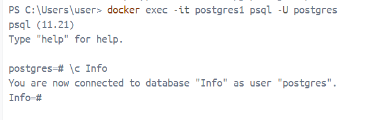
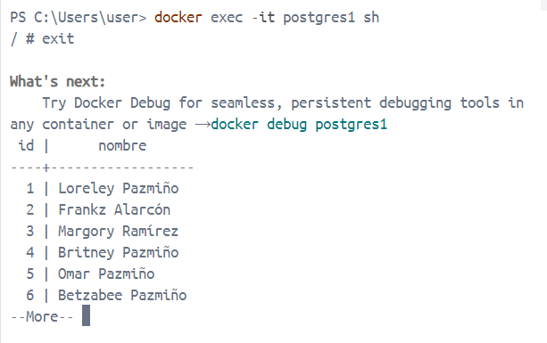

### Crear contenedor de Postgres sin que exponga los puertos. Usar la imagen: postgres:11.21-alpine3.17
 

### Crear un cliente de postgres. Usar la imagen: dpage/pgadmin4

 

La figura presenta el esquema creado en donde los puertos son:
- a: Es el puerto con el cual accedo a pgAdmin4 desde el navegador. Lo he mapeado a 80.
- b: Este puerto es el que usa pgAdmin4 para conectarse al servidor PostgreSQL. El puerto por defecto de PostgreSQL es 5432.
- c: Es el puerto en el que corre el servidor PostgreSQL internamente. Por lo general, es también 5432.

## Desde el cliente
### Acceder desde el cliente al servidor postgres creado.

### Crear la base de datos info, y dentro de esa base la tabla personas, con id (serial) y nombre (varchar), agregar un par de registros en la tabla, obligatorio incluir su nombre.

## Desde el servidor postgresl
### Acceder al servidor
### Conectarse a la base de datos info

### Realizar un select *from personas

